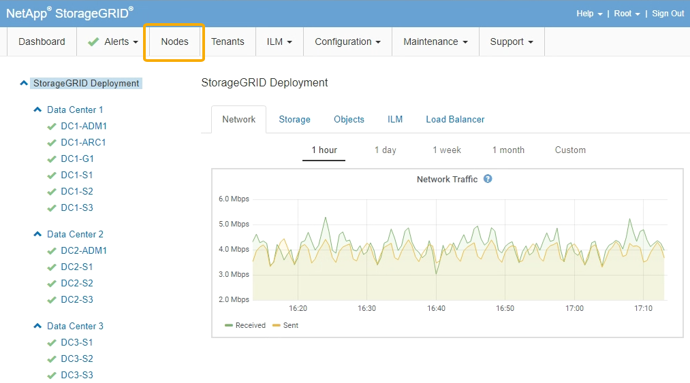

= Exploring the Grid Manager
:icons: font
:imagesdir: ../media/

[.lead]
The Grid Manager is the browser-based graphical interface that allows you to configure, manage, and monitor your StorageGRID system.

When you sign in to the Grid Manager, you are connecting to an Admin Node. Each StorageGRID system includes one primary Admin Node and any number of non-primary Admin Nodes. You can connect to any Admin Node, and each Admin Node displays a similar view of the StorageGRID system.

You can access the Grid Manager using a supported web browser.

== Web browser requirements

You must use a supported web browser.

[cols="1a,1a" options="header"]
|===
| Web browser| Minimum supported version
| Google Chrome
| 87

| Microsoft Edge
| 87

| Mozilla Firefox
| 84
|===
You should set the browser window to a recommended width.

[cols="1a,1a" options="header"]
|===
| Browser width| Pixels

| Minimum
| 1024

| Optimum
| 1280
|===

== Grid Manager Dashboard

When you first sign in to the Grid Manager, you can use the Dashboard to monitor system activities at a glance.

The Dashboard includes summary information about system health, storage use, ILM processes, and S3 and Swift operations.

image::../media/grid_manager_dashboard.png[Dashboard in the Grid Manager]

For an explanation of the information on each panel, click the help icon image:../media/icon_nms_question.gif[question mark icon] for that panel.

.Related information

link:../monitor/index.html[Monitor & troubleshoot]

== Alerts menu

The Alerts menu provides an easy-to-use interface for detecting, evaluating, and resolving issues that might occur during StorageGRID operation.

image::../media/alerts_menu.png[Alerts Menu]

From the Alerts menu, you can do the following:

* Review current alerts
* Review resolved alerts
* Configure silences to suppress alert notifications
* Configure the email server for alert notifications
* Define alert rules for conditions that trigger alerts

.Related information

link:monitoring-and-managing-alerts.html[Monitoring and managing alerts]

link:../monitor/index.html[Monitor & troubleshoot]

== Nodes page

The Nodes page displays information about the entire grid, each site in the grid, and each node at a site.

The Nodes home page displays combined metrics for the entire grid. To view information for a particular site or node, click the appropriate link on the left.

.Related information

link:viewing-nodes-page.html[Viewing the Nodes page]

link:../monitor/index.html[Monitor & troubleshoot]

== Tenant Accounts page

The Tenant Accounts page allows you to create and monitor the storage tenant accounts for your StorageGRID system. You must create at least one tenant account to specify who can store and retrieve objects and which functionality is available to them.

The Tenant Accounts page also provides usage details for each tenant, including the amount of storage used and the number of objects. If you set a quota when you created the tenant, you can see how much of that quota has been used.

image::../media/tenants_menu_and_page.png[Tenants Menu and Page]

.Related information

link:managing-tenants-and-client-connections.html[Managing tenants and client connections]

link:../admin/index.html[Administer StorageGRID]

link:../tenant/index.html[Use a tenant account]

== ILM menu

The ILM menu allows you to configure the information lifecycle management (ILM) rules and policies that govern data durability and availability. You can also enter an object identifier to view the metadata for that object.

.Related information

link:using-information-lifecycle-management.html[Using information lifecycle management]

link:../ilm/index.html[Manage objects with ILM]

== Configuration menu

The Configuration menu allows you to specify network settings, system settings, monitoring options, and access control options.

image::../media/configuration_menu.png[Configuration Menu]

.Related information

link:configuring-network-settings.html[Configuring network settings]

link:managing-tenants-and-client-connections.html[Managing tenants and client connections]

link:reviewing-audit-messages.html[Reviewing audit messages]

link:controlling-storagegrid-access.html[Controlling StorageGRID access]

link:../admin/index.html[Administer StorageGRID]

link:../monitor/index.html[Monitor & troubleshoot]

link:../audit/index.html[Review audit logs]

== Maintenance menu

The Maintenance menu allows you to perform maintenance tasks, network tasks, and system tasks.

image::../media/maintenance_menu_and_page.png[Maintenance Menu and Page]

=== Maintenance Tasks

Maintenance tasks include:

* Decommission operations to remove unused grid nodes and sites.
* Expansion operations to add new grid nodes and sites.
* Recovery operations to replace a failed node and restore data.

=== Network

Network tasks you can perform from the Maintenance menu include:

* Editing information about DNS servers.
* Configuring the subnets that are used on the Grid Network.
* Editing information about NTP servers.

=== System

System tasks you can perform from the Maintenance menu include:

* Reviewing details for the current StorageGRID license or uploading a new license.
* Generating a Recovery Package.
* Performing StorageGRID software updates, including software upgrades, hotfixes, and updates to the SANtricity OS software on selected appliances.

.Related information

link:performing-maintenance-procedures.html[Performing maintenance procedures]

link:downloading-recovery-package.html[Downloading the Recovery Package]

link:../expand/index.html[Expand your grid]

link:../upgrade/index.html[Upgrade software]

link:../maintain/index.html[Maintain & recover]

link:../sg6000/index.html[SG6000 storage appliances]

link:../sg5700/index.html[SG5700 storage appliances]

link:../sg5600/index.html[SG5600 storage appliances]

== Support menu

The Support menu provides options that help technical support analyze and troubleshoot your system. There are two parts to the Support menu: Tools and Alarms (legacy).

image::../media/support_menu.png[Support menu]

=== Tools

From the Tools section of the Support menu, you can:

* Enable AutoSupport.
* Perform a set of diagnostic checks on the current state of the grid.
* Access the Grid Topology tree to view detailed information about grid nodes, services, and attributes.
* Retrieve log files and system data.
* Review detailed metrics and charts.
+
IMPORTANT: The tools available from the *Metrics* option are intended for use by technical support. Some features and menu items within these tools are intentionally non-functional.

=== Alarms (legacy)

From the Alarms (legacy) section of the Support menu, you can review current, historical, and global alarms, and you can set up email notifications for legacy alarms and AutoSupport.

.Related information

link:storagegrid-architecture-and-network-topology.html[StorageGRID architecture and network topology]

link:storagegrid-attributes.html[StorageGRID attributes]

link:using-storagegrid-support-options.html[Using StorageGRID support options]

link:../admin/index.html[Administer StorageGRID]

link:../monitor/index.html[Monitor & troubleshoot]

== Help menu

The Help option provides access to the StorageGRID Documentation Center for the current release and to the API documentation. You can also determine which version of StorageGRID is currently installed.

image::../media/help_menu.png[Help Menu]

.Related information

link:../admin/index.html[Administer StorageGRID]
